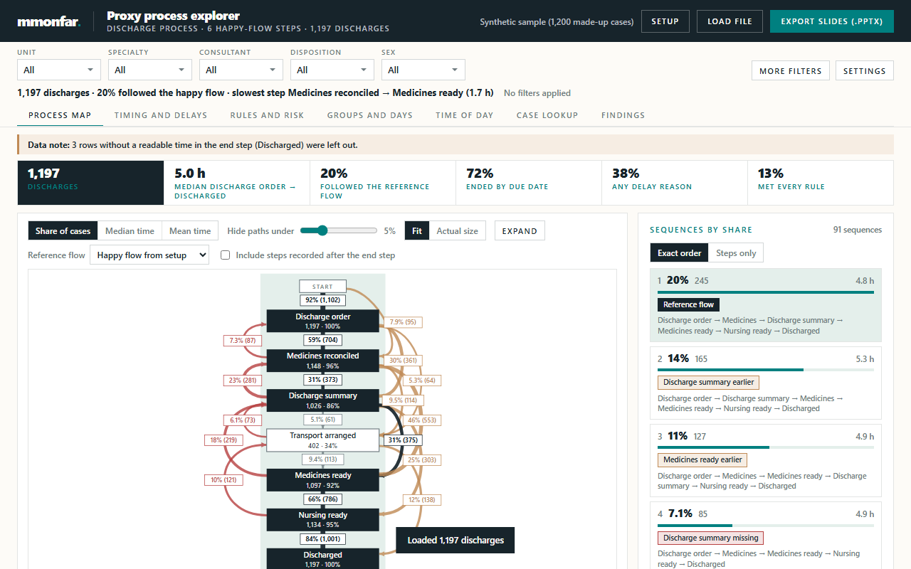

# Proxy Process Explorer

**Status: Prototype.** Built and tested on synthetic data only.

A single HTML file that turns a spreadsheet of step timestamps into a process view: a map of how cases actually moved through the steps, how long each wait took, where cases left the expected path, and which groups differ. It runs offline in the browser. Nothing is uploaded.



## Why "proxy" process mining

Process mining proper starts from an **event log**: one row per event, with a case ID, an activity name, a timestamp and usually a resource (who did it). From that log you can discover a process model, replay cases against it and measure conformance, rework and hand-offs between people.

Many operational extracts are not shaped like that. They hold **one row per case and one timestamp column per step** (order placed, medicines reconciled, summary written, patient discharged). That is enough to:

- sort each case's steps into a sequence and count the distinct sequences (variants);
- draw a directly-follows graph (which step came straight after which, how often, how long the gap was);
- compare every case with a reference flow and name what was missing, added or out of order;
- measure time from the start step to every other step, and find the step most often completed last.

It is not enough to:

- see a step that happened twice (rework or loops), because each step has one column and one timestamp;
- know who did a step, so hand-offs between people or teams cannot be measured;
- discover a process model or check conformance against one in the formal sense. "Followed the reference flow" here means the same steps in the same order, nothing missing or added.

This tool does the first list honestly and says so on every slide it exports. For the full event-log approach (a canonical pseudonymous event stream, process discovery, conformance and resource analysis), see the companion project **Hospital ward process mining model**, which is the reference architecture for this scaffold.

## Quick start

1. Open `dist/process_explorer.html` in a current browser (Edge, Chrome or Firefox). No install, no server.
2. Click **Try the synthetic sample**, or load your own `.csv` or `.xlsx`.
3. Walk through the setup:
   - **Columns**: each column gets a role (step timestamp, case ID, variable, delay reason, due date, or ignore). Roles are suggested from the values. Columns whose names look like personal data (names, dates of birth, record numbers, contact details) are ignored by default.
   - **Happy flow**: put the steps in the order they should happen and tick the ones that belong to the expected path. The first ticked step starts the clock; the last ticked step ends the case.
   - **Rules**: optional expectations, such as "discharged within 6 h of the order", "medicines reconciled never before the order", "summary recorded" or "discharged before 14:00". Each rule shows its result on the loaded file as you add it.
   - **Variables**: tick the variables that are relevant for risk.
4. Explore the tabs, then **Export slides (.pptx)** for a report built from the current filters.

## Hero demo (self-playing)

`dist/demo.html` is a standalone page (about 70 KB, no network, no upload, no libraries) that plays the explorer on the synthetic sample in about 38 seconds, looping: columns detected, happy flow snaps into order, five rules checked while the counters tick up (cases checked, rule breaks, % on time), the process map draws itself, three plain-language findings land, then a call to action ("Try it with the sample" opens `process_explorer.html#sample`, plus the GitHub link). A caption explains every step in plain words.

- Every number comes from the real engine: `npm run build` runs `src/core.js` on the sample (`src/demo/facts.mjs`) and embeds the results; the page only plays them back through one pure state function (`src/demo/timeline.js`), so counters can never show NaN and the final values equal the engine's.
- Pause, Replay, and step buttons are keyboard accessible; it works at 390 px width. With `prefers-reduced-motion` it shows the finished picture and waits for Play.
- To embed on a website: put `demo.html` and `process_explorer.html` side by side, or change the link in `src/demo/demo.html` and rebuild; an iframe at 100% width works.

## What the tabs show

| Tab | Content |
|---|---|
| Process map | Directly-follows graph against the reference flow (happy flow, most common sequence, or any sequence you pick), plus the list of sequences and how each differs from the reference. Click a step, arrow or sequence to list its cases. |
| Timing and delays | Each step measured from the start step, the step most often completed last, the slowest transitions, and the recorded delay reasons. |
| Rules and risk | Share of cases meeting each rule. For the rule you pick: factor-by-factor comparison, an adjusted comparison, which steps were still open at the deadline, and a funnel plot by group. |
| Groups and days | Any variable, day of week, weekday or weekend, month, delay reason or rule result as a breakdown table. |
| Time of day | Day-by-hour grid of cases, median duration or share following the reference flow. |
| Case lookup | One case against the filtered medians, with its rule results. |
| Findings | Plain statements calculated from the filtered cases, a draft of recommendations to edit, and data checks. |

## Rules and risk: method

- **Rules** are pure functions of one case: *met*, *breach*, or *not evaluable* when a step they need is missing. Four types: a step within a time limit of another, a step never before another, a step that must be recorded, and a step before a clock time (on its own day, or on the start day plus N days, which handles cases that run past midnight).
- **Factors** are built from the setup: the start step late on the end day, the start the day before or earlier, weekend, each non-anchor step not recorded, each delay reason recorded, and each frequent value of the variables marked relevant for risk (dummy coded against all other values). Factors with fewer than the minimum number of cases on either side are left out.
- **Factor table**: share meeting the rule with and without the factor, the difference and its 95% confidence interval (normal approximation).
- **Adjusted comparison**: logistic regression of a breach on all factors together (Newton-Raphson), reported as odds ratios with 95% intervals. Factors that do not vary, or that perfectly separate the outcome, are named and left out. Fewer than 50 complete cases or 10 events on either side: no model.
- **Funnel plot**: each group's rate against the overall rate, with binomial limits at 95% and 99.8% for the group's volume.
- All of it describes associations in the loaded data. None of it establishes a cause, and a group outside a limit is a prompt to review, not a finding of poor practice.

**Export setup (.json)** saves the choices. Import it next month and the same file layout is set up in one click. The last setup used for a file layout is also remembered in the browser.

## What your file should look like

| case_id | unit | order_at | step_b_at | … | finished_at | delay_reason |
|---|---|---|---|---|---|---|
| C-001 | Unit A | 2026-03-02 09:10 | 2026-03-02 10:05 | … | 2026-03-02 13:40 | Awaiting transport |

- One row per case. Column names are free.
- At least two timestamp columns. Dates can be real spreadsheet dates or text such as `2026-03-02 09:10`, `02/03/2026 9:10` or `2 Mar 2026 09:10`. Day/month order is detected.
- The header row can sit below report titles.
- Rows without a time in the end step are left out and counted in the data checks.

## The setup file

The setup is one plain JSON document. The sample one is [`samples/synthetic_discharges.setup.json`](samples/synthetic_discharges.setup.json). Its schema is described in [`docs/CONFIG.md`](docs/CONFIG.md).

## Privacy and security

- The page carries a Content Security Policy that blocks every network request (`connect-src 'none'`, no external scripts, fonts or images). A loaded file stays in the tab's memory and is gone when the tab closes.
- Slides contain aggregate figures only. Case lists and the case lookup show case IDs; use an ID column that is not a patient identifier, or leave the ID unset.
- Exported `.pptx` files carry the report title and the tool name in their document properties, and no author, company or file path.

## Sample data

`samples/` holds a synthetic discharge process: 1,200 made-up cases from a seeded generator (`synthRows(42, 1200)` in `src/core.js`). Every case ID starts with `SYN-`. The delay reasons follow categories that appear across the published literature on delayed hospital discharge (medicines to take home, transport, results, senior review, family, community care, placement, documentation). No real record was used to build them.

## Build and test

Node 20 or later, no dependencies.

```bash
npm run build     # src/ -> dist/process_explorer.html (one self-contained file)
npm run samples   # regenerate samples/ from the seeded generator
npm test          # node:test suite
```

`src/core.js` holds all parsing and analysis as pure functions, and the tests drive it from the setup file, not through the page. `tests/traces.test.mjs` is a privacy check on the sample files: it confirms that the repository, the sample workbook and an exported deck contain no personal or identifying details.

## Layout

```
src/core.js         parsing, column profiling, setup, analysis, rules engine, risk statistics, SVG charts, PPTX writer, synthetic generator
src/ui.js           setup wizard (columns, happy flow, rules, variables) and explorer tabs
src/styles.css      page styles
src/index.html      page template
build.mjs           inlines the above into dist/process_explorer.html
tools/make_samples.mjs
samples/            synthetic CSV, XLSX and setup file
tests/              node:test suites
```

## Reading

- W. M. P. van der Aalst, *Process Mining: Data Science in Action*, 2nd ed., Springer, 2016. Event logs, directly-follows graphs, discovery and conformance.

## Disclaimer

This is an analysis prototype, **not a medical device**. It is not intended for diagnosis, treatment or any decision about an individual patient. It describes patterns in the data you load; check its results against the source before acting on them, and use it only with data you are allowed to process.

Built with AI assistance (Claude); all code and claims reviewed by the author.

Provided as is, without warranty; not for clinical decision-making. See LICENSE.

Synthetic or de-identified data only. Not for clinical use.

## Licence

Code is licensed under **AGPL-3.0-or-later** (see [`LICENSE`](LICENSE)); a commercial licence is available on request from the author via [LinkedIn](https://www.linkedin.com/in/martin-monteagudo-farina/). Non-code content is under [CC BY-NC 4.0](https://creativecommons.org/licenses/by-nc/4.0/). Details in [`LICENSING.md`](LICENSING.md).

## Independence and data notice

**Independence and data notice.** This is a personal project, developed independently in my own time and on my own equipment. It is not affiliated with, endorsed by, or representative of my employer or any other organisation. It contains no employer data, systems, code or confidential information. All data in this repository is synthetic or fictitious, and any resemblance to real patients, staff or events is coincidental. Views are my own.
